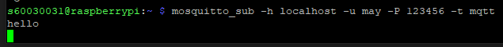
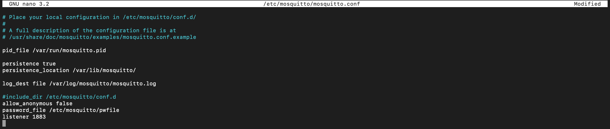
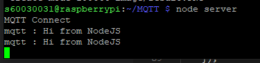
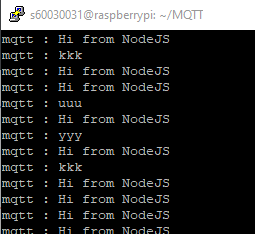

# MQTT Server with Node.js
## MQTT Server
MQTT (Message Queueing Telementry Transport protocol) คือ โปรโตคอลที่ใช้สื่อสารระหว่าง m2m(machine to machine) โดยออกแบบมาเพื่อรับส่งข้อมูลmujมีตัวกลางในการรับส่งคือ **MQTT Broker** 
- โปรโตคอลจะมีผู้ส่งคือ publisher ผู้รับคือ subscriber 
- การทำงานผู้ส่งจะทำการส่งข้อความไปยัง topic นั้น โดยผู้รับที่ติดตาม topic นั้นๆจะได้รับข้อความที่ผู้ส่งทำการส่งมา 
- โปรโตคอลนี้มีขนาดเล็กและใช้ bandwidth ต่ำกว่าพวก http จึงทำให้ MQTT ถูกนำไปประยุกต์ใช้กับอุปกรณ์ IOT มากกว่า http

### Mosquitto MQTT Broker
Mosquitto คือ ​MQTT Broker อันดับต้นที่ถูกใช้งาน โดยใน repo นี้จะทำการติดตั้ง Mosquitto บน RaspberryPI3 ด้วยคำสั่ง

```
    sudo apt-get install mosquitto mosquitto-clients
```

เมื่อทำการติดตั้งเรียบร้อย สามารถทำการทดสอบได้โดยเปิด terminal -7hoมา 2 terminal โดย terminal แรกจะทำหน้าที่เป็น subscriber โดยในที่นี้จะทำการ subscribe ไปยัง topic ที่มีชื่อว่า mqtt ด้วยคำสั่ง
```
    mosquitto_sub -h localhost -t mqtt
```

และใน terminal ที่สองจะทำหน้าที่เป็น publisher โดยในที่นี้จะทำการส่งข้อความว่า hello ไปยัง topic mqtt ด้วยคำสั่ง
```
    mosquitto_pub -h localhost -t mqtt -m "hello"
```
เมื่อเรียบร้อยแล้ว terminal แรกจะปรากฎข้อความ hello world ขึ้นมา ดังรูป



#### การกำหนด username และ password ในการเข้าใช้ MQTT
1. ทำการแก้ไขไฟล์ /etc/mosquitto/mosquitto.conf ให้เป็นดังนี้



2. เพิ่ม username ไปยัง /etc/mosquitto/pwfile ที่กำหนดไว้ในขั้นตอนที่ 1 โดยใช้คำสั่ง
```
    sudo mosquitto_passwd -c /etc/mosquitto/pwfile username

    Password: password
    Reenter password: password
```
3. ทำการ reboot RaspberryPI3 ด้วยคำสั่ง
```
    sudo reboot
```
4. ทดสอบการทำงานโดยเปิด terminal ขึ้นมาจำนวน 2 terminal 

    1. terminal ที่ทำหน้าที่เป็น subsciber จะ subscibe ไปยังยัง topic ที่มีชื่อว่า mqtt โดยใช้คำสั่ง
    ```
        mosquitto_sub -h localhost -u username -P password -t mqtt
    ``` 
    2. terminal ที่ทำหน้าที่เป็น publisher จะทำ publish ไปยัง topic ที่มีชื่อว่า mqtt โดยใช้คำสั่ง โดยส่งคำว่า hello
    ```
        mosquitto_pub -h localhost -u username -P password -t mqtt -m "hello"
    ```
    เมื่อเรียบร้อยแล้วใน terminal แรกจะปรากฎข้อความ  hello 

## MQTT.js
คือ library สำหรับ MQTT Protocol ที่ถูกเขียนในภาษา JavaScript สำหรับ Node.js สามารถทำการติดตั้งได้โดยเปลี่ยน directory ที่ทำงานไปยังตำแหน่งที่ต้องการและใช้คำสั่ง
``` 
    npm install mqtt --save
```
จากนั้นทำการเชื่อมต่อเข้าไปยัง MQTT Broker โดยในที่นี้จำทำหน้าที่เป็นทั้ง subscriber และ publisher  

- subscribe ไปยัง topic mqtt
- publish ข้อความ Hi from NodeJS ไปยัง topic mqtt 

ซึ่งสามารถทำได้โดยเพิ่มคำสั่งดังต่อไปนี้ไปยังไฟล์ .js ที่ต้องการ (ในที่นี้จะใช้ server.js)

```js
    var mqtt=require("mqtt");

    const MQTT_SERVER="localhost";
    const MQTT_PORT="1883";

    const MQTT_USER="may";
    const MQTT_PASSWORD="123456";

    var client=mqtt.connect({   
	    host: MQTT_SERVER,
	    port: MQTT_PORT,
	    username: MQTT_USER,
	    password: MQTT_PASSWORD
    });

    client.on('connect',()=>{
	    console.log("MQTT Connect");
	    client.subscribe('mqtt',(err)=>{
		    if(err)console.log(err);
	    });
    });

    client.on('message',(topic,message)=>{
        console.log(topic.toString()+" : "+message.toString());
    });

    setInterval(()=>{
        client.publish("mqtt","Hi from NodeJS");
    },5000);

```
ทดสอบการทำงานโดยการใช้คำสั่ง 
```
    node server
```


หากมี subscriber ทำการ subscribe มายัง topic ที่มีชื่อว่า mqtt แล้ว subscriber นั้นจะได้รับข้อความเหมือนดังรูปข้างต้น

และหากมี publisher ทำการเชื่อมต่อมายัง topic mqtt และทำการ publish ข้อความขึ้นมา ข้อความดังกล่าวจะปรากฎในหน้า console เช่นเดียวกัน 

